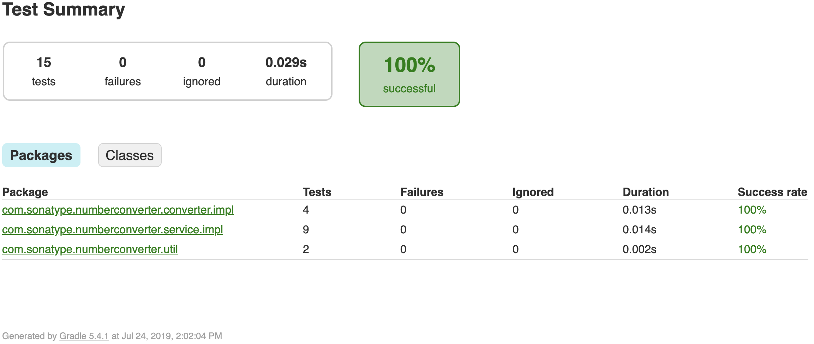

# About the project - NumberConverter
This is a Spring Boot Shell REPL project with Kotlin which transforms numbers into its English equivalent.
There are some business restrictions, which are:
- Number should be a 32 bits integer.
- Decimals are not allowed. 

These are some examples:

- `432 -> four hundred thirty two`
- `2147483647 -> two billion one hundred forty seven million four hundred eighty three thousand six hundred forty seven.`
- `0 -> zero`

# Requirements
Just two thinks:
- Java 8
- Gradle, since we are using gradlew to build the project to be consistent with the gradle version during development 
any version may work.

# Folder Structure
```
.
├── src                                     # All the application sources are here
│   ├── main                                # The main application
│   │    ├── kotlin                         # Where the full application is stored
│   │    └── resources                      # Just the home of the `application.yml` file
│   └── test                                # Home of the unit tests
├── gradle                                  # Gradle wrapper
└── *
```

# How to execute
Spring boot let us define different profiles to execute our application, right now the only difference between them 
its the Logger level.

To execute the project remember to be at the root of the project.

You may change the configuration in the `application.yml` file

### Development Mode
For testing purposes I higly recommed using the production mode, but if you still want a fast way to execute the project just execute:
- `./gradlew bootRun --console=plain`

### Production Mode
To execute the application in this mode lets execute in steps, the following commands:
- `./gradlew clean build`
- `java -Dspring.profiles.active=PROD -jar build/libs/com.sonatype.numberconverter-1.0.jar`

### Playing with the application
Once you've executed the application you are probably seeing a console prepared to accept commands. Just type 
`convert <number>` to start converting numbers like this: `convert 123`.

# Unit Tests
These can be found at the `src/test` folder. You can also execute the unit testing with `./gradlew test` the results 
will be generated at `build/reports/tests/test/index.html`

